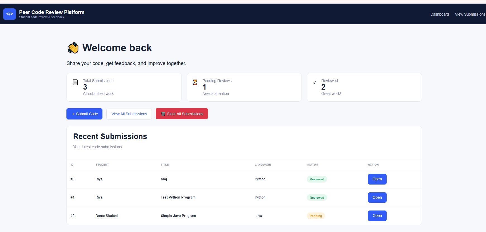
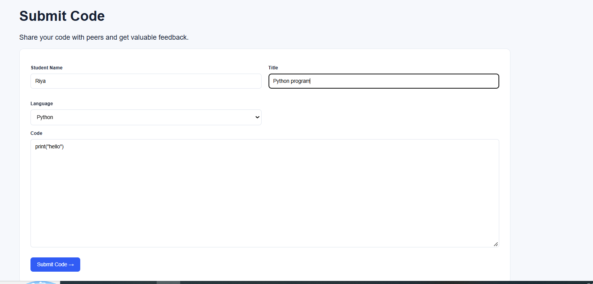
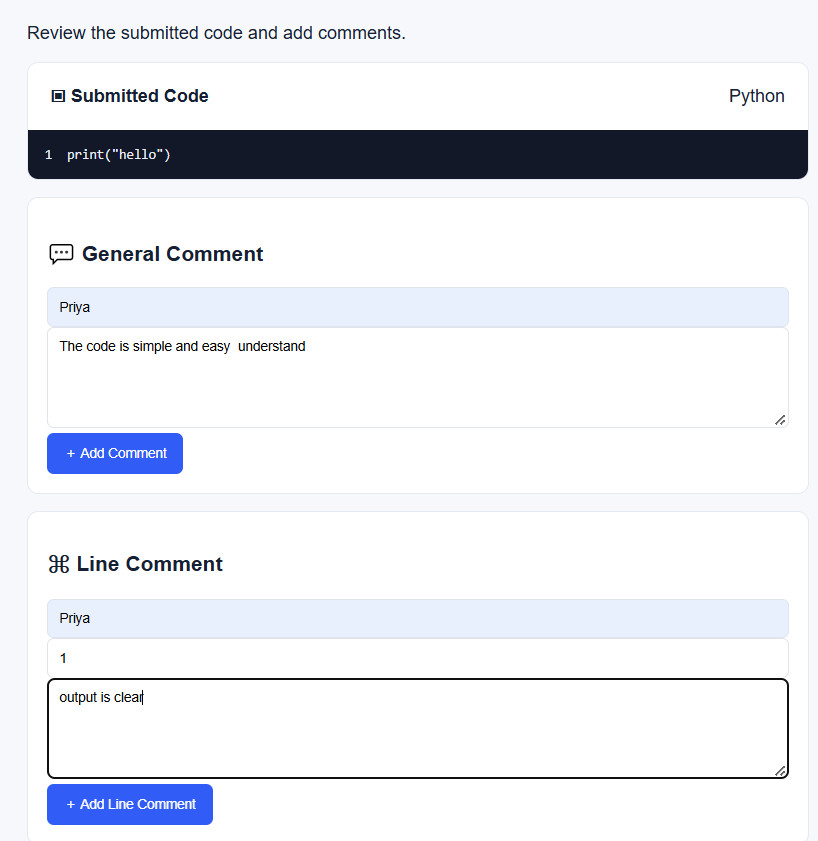
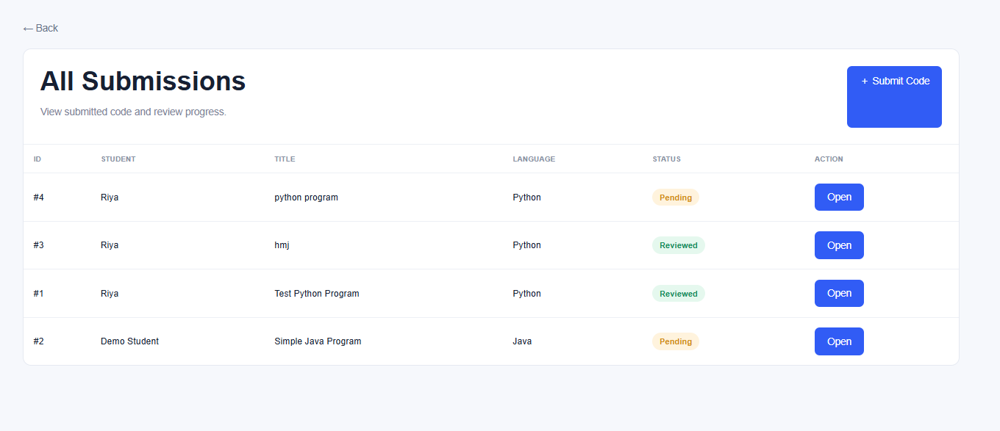
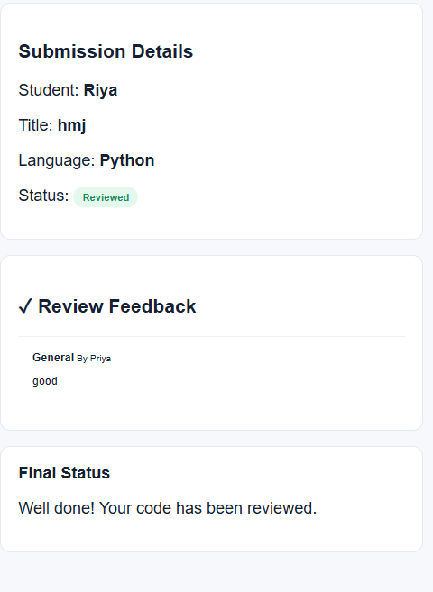

# Peer Code Review Platform for Students

## Features
- Submit code
- View submitted code
- General comments
- Line-specific comments
- Review status tracking
- View feedback

## Stack
Frontend: HTML/CSS | Backend: PHP | Database: MySQL | Server: XAMPP

## Run
1. Install XAMPP.
2. Start Apache and MySQL.
3. Copy this folder to `C:\xampp\htdocs\peer_code_review`.
4. Open phpMyAdmin and import `database.sql`.
5. Visit `http://localhost/peer_code_review/`.
6. Submit code, open it, and test general/line comments.

## Screenshots

